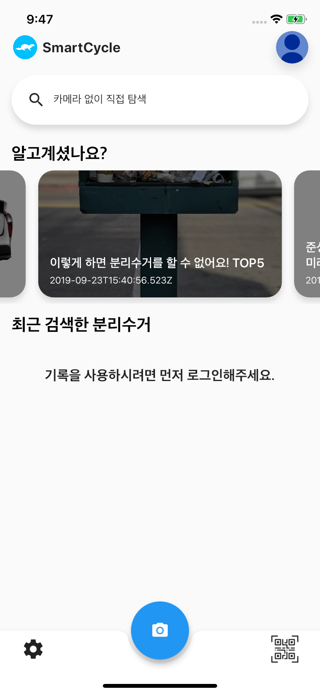
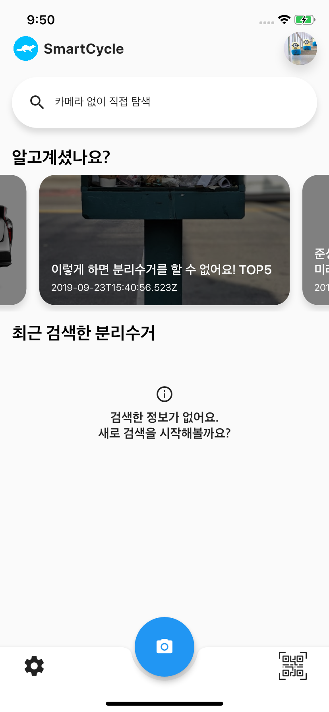
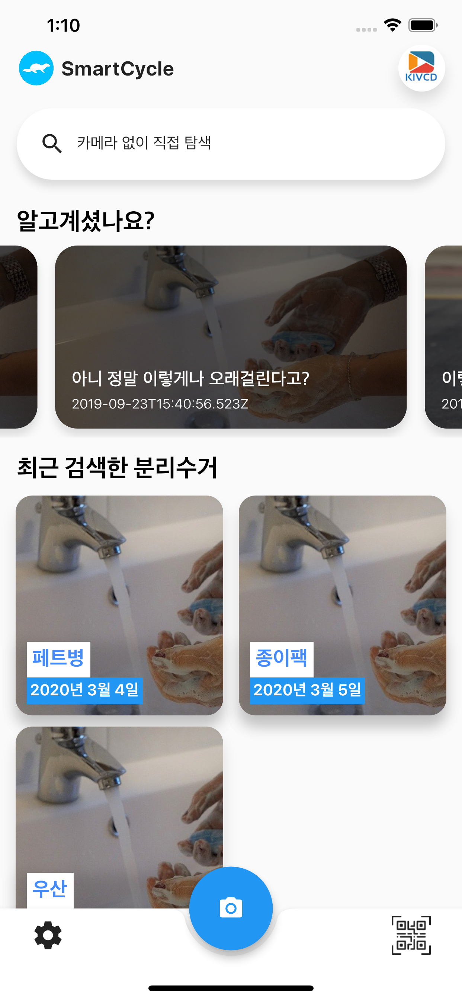
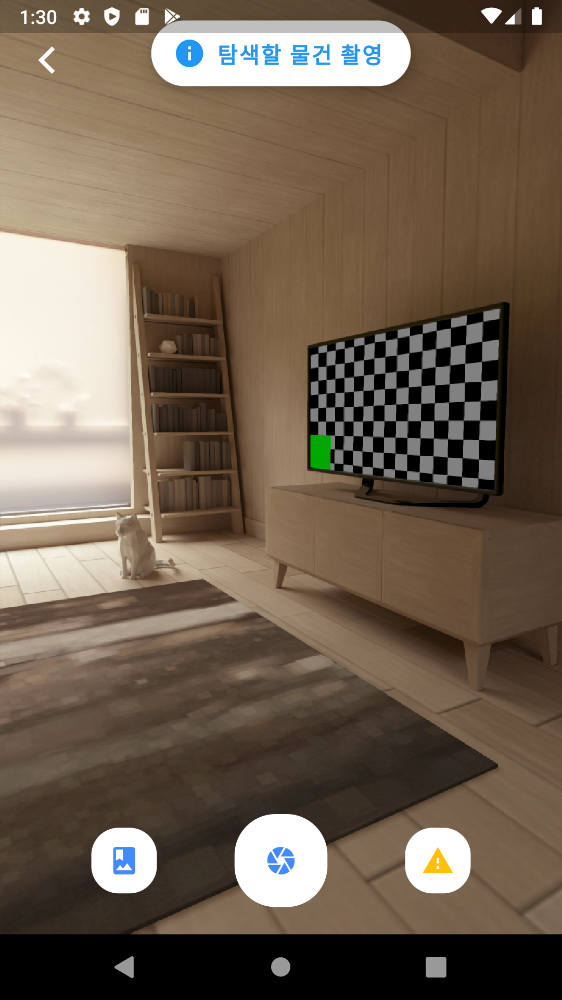
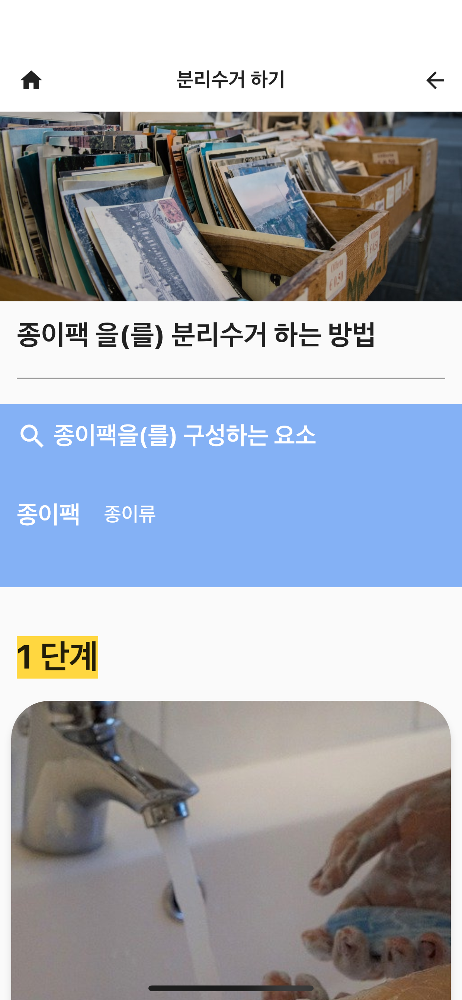
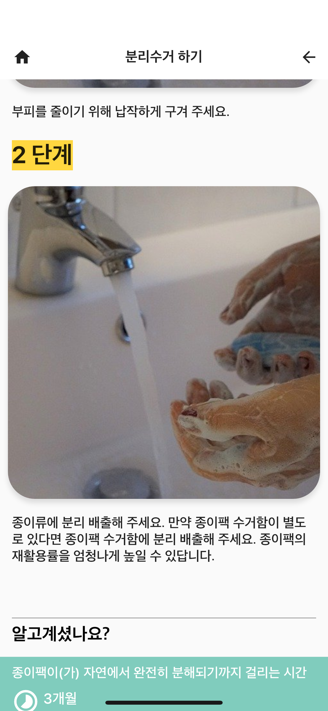
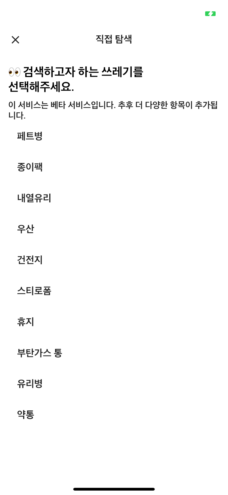
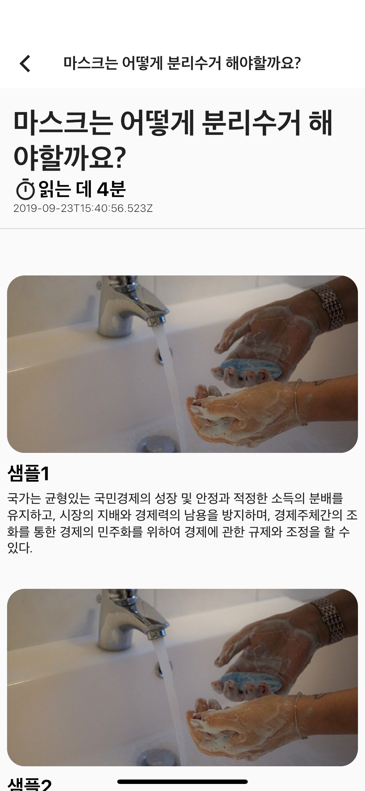
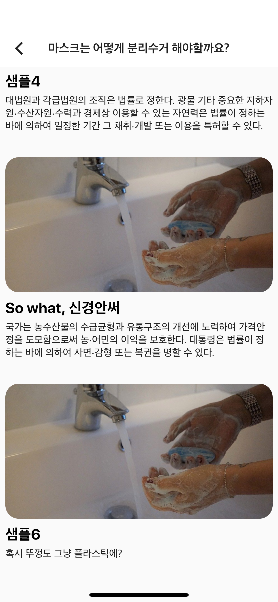

 
<h2 align="center"><b>SmartCycle</b></h2>
<h4 align="center">Sort up Trash by Oneshot</h4>

 

# 나를 위한 분리수거 서비스 - SmartCycle

더 이상 불편하게 직접 검색하지 않아도 됩니다.
분리수거 방법을 알고 싶은 물건의 사진을 찍기만 하면 쉽고 빠르게 알려주니까요.

## 단지 찍는 것만으로 분리수거

다음 사진은 앱의 메인화면입니다. 왼쪽은 비로그인, 오른쪽은 로그인한 상태입니다.

 
 
 

 
사진과 같이 메인화면에서 하단에 있는 카메라 버튼을 누르면 촬영으로 이동합니다.
촬영후 사진에는 없지만 제출후 인공지능 판독 결과가 나오고 사용자는 인공지능이 올바르게 인식했는지 확인합니다.
올바르게 인식하면 바로 분리수거 설명화면으로 이동하고, 그렇지 않으면 인공지능 피드백 화면에서 자신이 찾던 쓰레기 종류를 직접 선택합니다.
 

 
 
 

## 수동 검색

인공지능이 적절하게 동작하지 않을 경우 다음과 같이 수동 검색을 지원합니다.

## 알고 계셨나요?

SmartCycle에서는 검색기능과 더불어 흔하게 쓰면서도 분리수거하는 방법을 모르는 쓰레기들을 소개하는 기능이 있습니다.
또한 잘못된 상식을 소개하며 사용자가 바로잡기를 권유합니다.

## 다국어 지원
SmartCycle은 다국어를 지원합니다. (English, 한국어, 日本語, 中文)
루트 디렉토리의 lang폴더에 json파일로 각각 있습니다.

번역은 완벽하지 않으며 진행중입니다.

## Made with Flutter
Flutter 프레임 워크로 제작되었으므로 앞서 보여드린 바와 같이 iOS와 Android에서도 동작합니다.

## License
이 소스코드는 오픈소스가 아닙니다.
오직 <a href="https://tacademy.skplanet.com/front/exhibition/listExhibition.action">스마틴 앱 챌린지(STAC)</a>에 참가하는 학생들만이 사용할 수 있습니다.

참가 학생이 아니지만 사용하고 싶은 분은 <b>kwonkiseok7@gmail.com</b> 으로 연락부탁드립니다.

## SmartCycle Go- 홈 화면에서 바로 분리수거 시작
> <https://github.com/MODORIAPPS/SmartCycle-Go>
